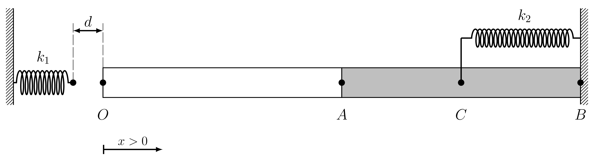

# Question 1 #

Consider the horizontal bar shown in the figure, with length (in the appropriate units) $L=2\pi$ and cross\-sectional area $A_s =3.0$; its right end is fixed to the wall.  We place the origin of coordinates at the left end of the bar (point ), so that the  values increase to the right. The Young’s modulus, , of the material forming the bar depends on $x$ according to the formula:

$$ 
E(x)=\left\lbrace 
     \begin{array}{ll} 
        \pi\left(2+\cos x\right), & 0\le x<\pi ,\\ 
        \pi , & \pi \le x\le 2\pi . 
     \end{array}\right. 
$$ 

The springs are initially relaxed. The spring attached to the wall on the left has a stiffness constant $k_1 =1.0$, and its right end is located at a distance $d=1.0$ from the left end of the bar (point $O$ ). The spring attached to the wall on the right has a stiffness constant $k_2 =3.0$ and is connected to the midpoint, point $C$, of segment $\overline{AB}$ (see the Figure).

We want to study the deformation of the bar when the spring on the left is connected to the end $O$. To do this, we will use the finite element method with two elements of length $h=\pi$: the first one linear, the second quadratic, located respectively over segments $\overline{OA}$ and $\overline{AB}$ of the Figure. The first global node is placed at point $O$, and the subsequent nodes are numbered in ascending order towards the right. Under these conditions, the following is requested:

(a) (3 points) The components of $K_{3,3}$ of the global stiffness matrix

- [ ] 17 
- [ ] 13 
- [ ] 19 
- [ ] 14 
- [x] 16
- [ ] Leave it empty (no penallty) 
- [ ] 15 
- [ ] 18 

**Hint.** The trace of the stiffness matrix is $\mathop{\mathrm{tr}}K=42$.

(b) (3 points) The displacement, $u_2$, of the point $A$ 

- [ ] \-1.9847e\-01 
- [ ] \-1.6936e\-01 
- [ ] \-2.2429e\-01 
- [ ] Leave it empty (no penalty) 
- [ ] \-2.1380e\-01 
- [ ] \-2.3079e\-01 
- [ ] \-1.5088e\-01 
- [x] \-1.9095e\-01 

(c) (2 points) The value of $Q_1$ 

- [x] \-6.9347e\-01 
- [ ] \-6.6008e\-01 
- [ ] \-6.8415e\-01 
- [ ] \-6.9944e\-01 
- [ ] \-6.8339e\-01 
- [ ] \-7.1009e\-01 
- [ ] Leave it empty (no penalty) 
- [ ] \-6.7232e\-01 

**Hint.** The value of $Q_3$ is $Q_3 =$ 2.4121e\-01.

(d) (2 points) The displacement (interpolated from the values of
    the element's nodes' displacements it 
    belongs to) of the point $P$, located at 
    $x_P =\pi / 4$ 

- [ ] \-2.3151e\-01 
- [x] \-2.7764e\-01 
- [ ] Leave it empty (no penalty) 
- [ ] \-3.2410e\-01 
- [ ] \-3.1442e\-01 
- [ ] \-2.7235e\-01 
- [ ] \-2.3700e\-01 
- [ ] \-2.4911e\-01 
