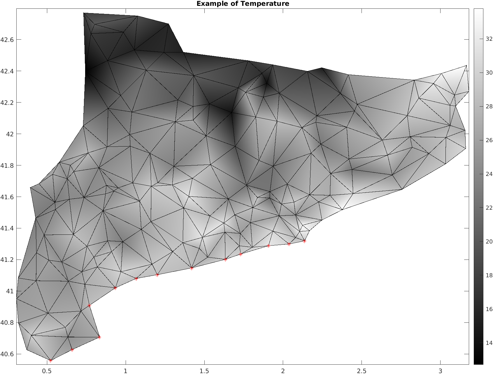

# Question 3

Consider the triangle mesh of Catalonia obtained loading the file `estacions.m` and which can be seen in the figure. The nodes correspond to weather stations whose longitude ( $x$ variable) and latitude ( $y$ variable) are recorded in the first and the second columns of the matrix named `dat`. The remaining columns correspond to the temperature (in °C) recorded at intervals of 30 min from 1 AM to 7 AM on an August night. For instance, the last column corresponds to the value of the temperature at 7 AM of the weather station of that line. The matrix named `elem` is the usual connectivity matrix.

(a) (2 points) Consider the station (node) given by the row number 54 of the  `dat` matrix. Assuming that we take quadratic elements on` $\Omega^1 =[1,2]$, $\Omega^2 =[2,3]$, $\Omega^3 =[3,4],\ldots$ Which is the interpolated value of the temperature (in °C) at 3h 40min?

 - [ ] Empty answer (no penalty)
 - [ ] 2.26556e+01
 - [ ] 2.29889e+01
 - [x] 2.27667e+01
 - [ ] 2.28778e+01
 - [ ] 2.31000e+01
 - [ ] 2.25444e+01
 - [ ] 2.32111e+01

(b) (2 points) How many stations had a minimum temperature strictly larger than 24°C?

- [ ] 22
- [ ] Empty answer (no penalty)
- [ ] 24
- [ ] 23
- [ ] 26
- [ ] 25
- [ ] 20
- [x] 21

(c) (3 points) Which is the interpolated temperature at 1h AM at the point with coordinates $(2.5,41.7)$?

- [ ] 2.33010e+01
- [ ] 2.40396e+01
- [ ] 3.43680e+01
- [ ] 3.42122e+01
- [x] 2.40489e+01
- [ ] 2.14762e+01
- [ ] Empty answer (no penalty)
- [ ] 3.03443e+01

(d) (3 points) Consider the stations at the Meditarranean coast below Barcelona, which lie at the boundary between Station 69 in the Southwest and station 167 in the Northeast, both included (see Figure). Which is the average (mean) temperature at 5 h AM?

- [ ] 1.97777e+01
- [ ] 3.06482e+01
- [ ] 2.31178e+01
- [ ] Empty answer (no penalty)
- [ ] 1.82818e+01
- [ ] 3.17282e+01
- [x] 2.35385e+01
- [ ] 3.28733e+01

