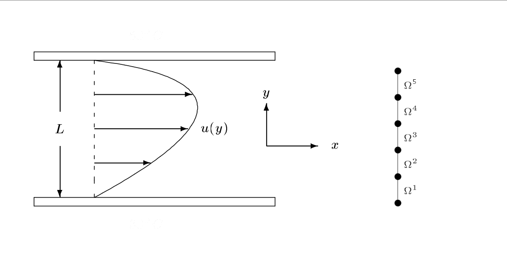

# Question 3
Consider a viscous fluid that moves along a pipe of rectangular section that is $L=10$ cm deep. Assuming that the pressure drop in the pipe is $180$ N/m $^2$ per meter, we want to find the velocity profile $u(y)$ of the fluid. The velocity profile satisfies the equation

$$ 
    -\frac{\mathrm{d}}{\mathrm{d}u}
    \left(\mu (y)\frac{\mathrm{d}u}{\mathrm{d}y}
    \right)=180, 
$$ 

where the viscosity $\mu (y)$ of the fluid is a function that is constant on each element, according to the following table:

$$
\begin{array}{rrrrrr} 
    \textrm{Element} & \Omega_1  & \Omega_2  & \Omega_3  & \Omega_4  & \Omega_5 \\\\ \hline
    \mu \:\textrm{(kg/m/s)} & 0.59 & 0.49 & 0.31 & 0.29 & 0.16\\\\ \hline \end{array} 
$$ 

Assume that the profile is meshed with $5$ equal linear elements as shown in the Figure. The fluid sticks to the walls of the pipe, imposing boundary conditions $u(y_1 )=u(y_6 )=0$ where $y_1$ and $y_6$ are the first and the last nodes.

(a) (2 points) The value $K_{1,1}^1$ is:

- [x] 29.5000
- [ ] Empty answer (no penalty)
- [ ] 26.5000
- [ ] 27.5000
- [ ] 31.5000
- [ ] 28.5000

**Hint:** $K_{1,1}^1 =24.5000$ 

(b) (6 points) The maximum velocity $u(y_i )$ among all nodes $y_i$ is:

 - [ ] 0.6367 *m/s*
 - [x] 0.7074 *m/s*
 - [ ] 0.6225 *m/s*
 - [ ] Empty answer (no penalty)
 - [ ] 1.3371 *m/s*
 - [ ] 0.6296 *m/s*

**Hint:** $\sum_{i=1}^6 u(y_i )=2.2053$ 

(c) (2 points) interpolate the solution values $u(y_i )$ using a function $p(y_i )=\sum_{i=0}^5 c_i y^i$. Evaluate $p(y)$ at half the depth of the pipe:

- [ ] 0.7168 *m/s*
- [ ] 0.5799 *m/s*
- [x] 0.6516 *m/s*
- [ ] 1.2315 *m/s*
- [ ] 0.5734 *m/s*
- [ ] Empty answer (no penalty)

**Hint:** $p(y=0.025)=0.3869$
